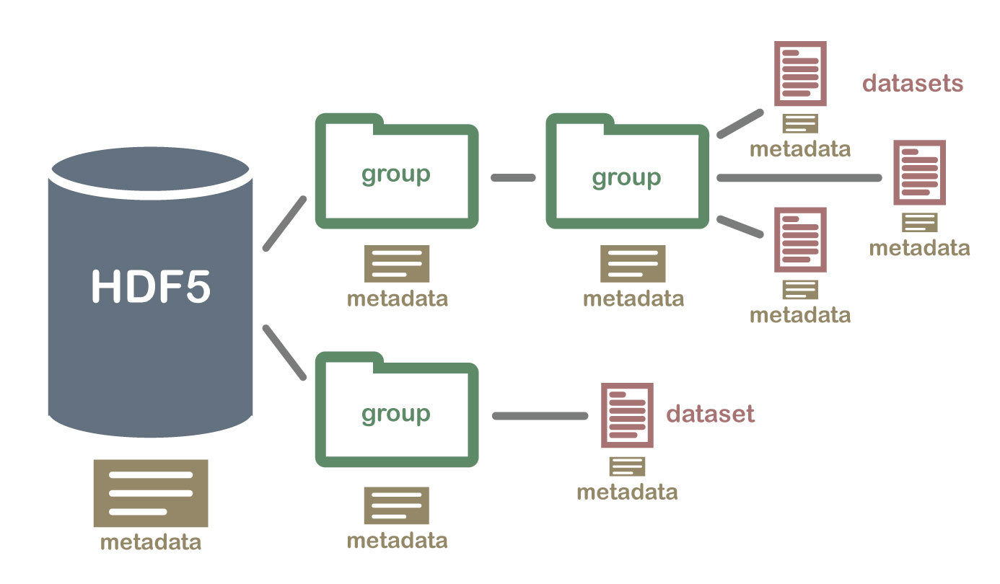
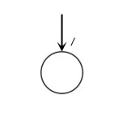
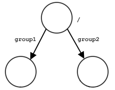
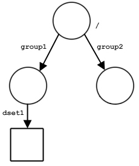
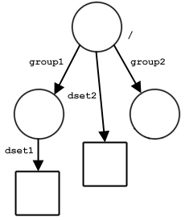

<section data-background-image="images/title.png" data-background-size="contain">
</section>

# Intro to HDF5

***

Hierarchical Data Format Version 5 (HDF5) is model for managing and storing data, which includes both the storage model (i.e., the file format .hdf) and the libraries for programming interfaces to implement this model (e.g., [h5py](https://www.h5py.org/)).

# HDF5 Data Model

***

The HDF5 file is a portable, self-describing file format that supports large and heterogeneously complex data.

***

There are three main components to the HDF5 data structure:

1. Groups
1. Datasets
1. Attributes

***

Groups
:   - analogous to a file system's directory (i.e., it's like a folder)
    - may contain zero or more objects
    - may have zero or more attributes
    - every object (other than the root group) must be a member of at least one group

***

Dataset
:   - a multi-dimensional array of data elements
    - a data element is a set of bits that describe a number, a character, an array of heterogeneous data elements (i.e., it can be just about anything)
    - has data type (description of the data)
    - has data space (layout of the data)
    - may have zero or more attributes
    - may be compressed

***

Attributes
:   - document an object (i.e., it's metadata)
    - have a name and data (e.g., like a key-attribute pair)
    - the attribute data is like a dataset, except:
        - it should be small
        - it only lives with its associated object
        - it cannot be partially read from memory
        - it may not have other attributes

***

# Designing HDF5 Files

***

It all begins with the root (/).

***

***

From there, you may define some groups.

***

***

And, in one of the groups, you put a dataset.

***

***

Then, you decide to add a dataset to your root group.

***

***

The world is your oyster.

***

](images/root_group_ds.jpg)

# Activity
Exploring HDF

***

Let's take a look at an example scenario.

> Find where all the plant life is located on Earth.

***

What data do we need?

&#8594; Global vegetation index

***

Where do we get it?

* NASA has two satellites in orbit: [Aqua](https://aqua.nasa.gov/) and [Terra](https://terra.nasa.gov/)

 

|   |   |
|:--:|:--:|
|||

***

Both satellites host the [Moderate Resolution Imaging Spectroradiometer](https://modis.gsfc.nasa.gov/about/) or MODIS for short

***

By combining spectral bands from MODIS, we can "see" vegetation coverage over the entire globe at about 16-day to one month averages (*it takes a while for these satellites to image the whole earth.*)

***

**How to Find This Data**

* MODIS data is maintained by [LP DAAC](https://lpdaac.usgs.gov/) (Land Processes Distributed Active Archive Center)

* You get access to all\* DAACs through [EarthData](https://earthdata.nasa.gov/)

<small>\*Some data are only available to select users/researchers.</small>

***

How do we access it?

&#8594; Create a [EarthData][earthdata] account.

[earthdata]: https://urs.earthdata.nasa.gov/home

***

1. Click "Register"
1. Complete the registration form
    - Affiliation: Education
    - User Type: Public User
    - Organization is "William & Mary"
    - Study Area: any; this example is for "Land Processes"

***

**Challenge**

In the LP DAAC, find the latest monthly 0.05 degree global EVI vegetation index from the Terra satellite in HDF file format.

What is the name of that file?

***

# Working with HDF Files

***

Let's try it out.

# Python API

***

We are going to use [h5py][h5py] to read and write the HDF5 file format.

[h5py]: https://github.com/h5py/h5py

***

Find `hdf_read.py` and `hdf_write.py` in the scripts folder of our [spatial-data-discovery.github.io][sddrepo] repository.

[sddrepo]: https://github.com/spatial-data-discovery/spatial-data-discovery.github.io

***

<iframe width="560" height="315" src="https://www.youtube.com/embed/PhOoyGg37Lk" frameborder="0" allow="accelerometer; autoplay; encrypted-media; gyroscope; picture-in-picture" allowfullscreen></iframe>

<small>
  
Please follow along with the demo.
</small>
