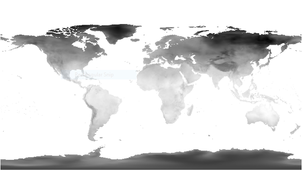
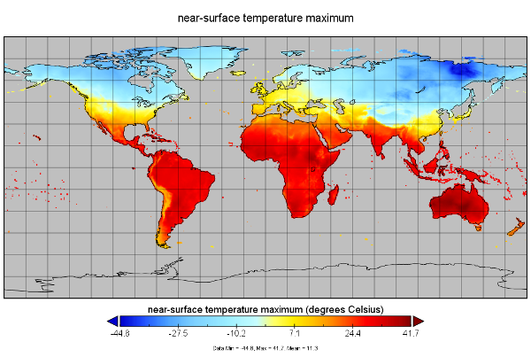

<section data-background-image="images/title.png" data-background-size="contain">
</section>

# Intro to NetCDF

<small>This presentation is written in [reveal.js](https://revealjs.com). Click the link to learn more about how to navigate reveal.js presentations.</small>

***

The Network Common Data Format ([netCDF][unidata]) file is a self-describing, portable, scalable, appendable, sharable and archivable binary data format.

[unidata]: https://www.unidata.ucar.edu/software/netcdf/

***

![Architecture Overview. [https://www.unidata.ucar.edu][ncarch]](images/netcdf_architecture.png)

[ncarch]: https://www.unidata.ucar.edu/software/netcdf/docs/netcdf_introduction.html#architecture

***

Let's start with the netCDF classic model.

# The Classic Model

***

There are three main components to the classic netCDF data structure:

1. Dimensions
1. Variables
1. Attributes

***

Dimensions ([more][ncdims])
:   Describe the axes of the data arrays.
    A dimension has a name and a length.
    An unlimited dimension has a length that can be expanded at any time, as more data are written to it.
    NetCDF files can contain at most one unlimited dimension.

[ncdims]: https://www.unidata.ucar.edu/software/netcdf/docs/group__dimensions.html#details

***

Variables ([more][ncvars])
:   - The only kind of data structure directly supported by netCDF classic format is a collection of named arrays.
    -  An array is an n-dimensional (where n is 0, 1, 2, ...) rectangular structure containing items which all have the same data type (e.g., 8-bit character, 32-bit integer).
    - A scalar (simple single value) is a 0-dimensional array.

[ncvars]: https://www.unidata.ucar.edu/software/netcdf/docs/group__variables.html#details

***

Attributes ([more][ncattrs])
:   Annotate variables or files with small notes or supplementary metadata, such as the name of the file creator or the instrument used to collect the data. Attributes can be associated with either a variable or the file as a whole. Although there is no enforced limit, the user is expected to keep attributes small (*don't store array data as attributes*).

<small>
[Differences between Attributes and Variables](http://www.bic.mni.mcgill.ca/users/sean/Docs/netcdf/guide.txn_19.html)
</small>

[ncattrs]: https://www.unidata.ucar.edu/software/netcdf/docs/group__attributes.html#details

***

*A quick note on unified modeling language (UML)*

* lines represent associations between properties/objects
* object with filled diamond defines a composition (strong) link to other object
    * the other object's existence depends on its parent
* object with open diamond defines an aggregation link to other object
    * other object's existence does not depend on a particular parent

<small>[https://www.visual-paradigm.com/][uml]</small>

[uml]: https://www.visual-paradigm.com/guide/uml-unified-modeling-language/uml-aggregation-vs-composition/

***

![NetCDF Classic Model UML. [https://www.unidata.ucar.edu][ncclassic]](images/nc-classic-uml.png)

[ncclassic]: https://www.unidata.ucar.edu/software/netcdf/docs/netcdf_data_model.html#classic_model

# The Enhanced Model

***

![NetCDF Enhanced Model UML. [https://www.unidata.ucar.edu][ncenhanced]](images/nc4-model.png)

[ncenhanced]: https://www.unidata.ucar.edu/software/netcdf/docs/netcdf_data_model.html#enhanced_model

***

Notice how the enhanced netCDF model resembles HDF by adding the hierarchy of groups and by introducing user-defined data types.

*That's because it uses HDF5 as its base format!*

***

For maximum portability, users are encouraged to use netCDF classic format to distribute data.

# Activity
Exploring NetCDF

***

Let's begin with an example scenario.

> What is the impact on global public health 
> of rising maximum air temperatures?

***

What data do we need?

&#8594; Global maximum air temperature

***

Where do we get it?

* Last time, we looked at NASA's satellite data, including MODIS; however, these datasets include surface temperature not air temperature.
* In this activity, we looked at WFDEI forcing data, which has average air temperature, not maximum.
* There is another service that provides data products, including those specific to the atmospheric conditions

***

**The Climatic Research Unit Time Series (CRU-TS)**

* CRU TS is maintained by the British Atmospheric Data Centre (BADC)

* BADC data is provided through the Center for Environmental Data Analysis (CEDA)

<small>
**Note:** CRU data have been "versioning up" over the years and recently have moved from NetCDF3 (CRU TS v3.X) to NetCDF4 (CRU TS v4.X). QGIS does not handle HDF5/NetCDF4 formats without some finagling.
</small>

***

What's available in CRU-TS?

- Percent cloud cover (CLD)
- Potential evapotranspiration (PET)
- Precipitation (PRE)
- Monthly average max/min air temperature (TMN, TMX)
- Vapor pressure (VAP)
- Wet day frequency (WET)
- Frost day frequency (FRS)

***

How do we access it?

&#8594; Create a [CEDA][ceda] account.

[ceda]: http://archive.ceda.ac.uk/

***

1. Click "My Account" at the top
1. Click "Register for an account!"
1. Continue to registration
1. Complete the form
    - Title (note "Mx" is gender-neutral designation)
    - "Other names" are your given (first) name(s)
    - Choose discipline closest to your own major or "Other"
    - Consider including your degree (note: BSc is bachelor of science)
    - Institute is "College of William and Mary"

***

1. Return to [archive.ceda.ac.uk](http://data.ceda.ac.uk/)
1. Click "Get Data"
1. Click "badc"

***

While you're here... scroll through all the options available through BADC.

***

Find `cru`

***

Take a look at the script found in [archive/badc/cru/software/third-party](http://data.ceda.ac.uk/badc/cru/software/third-party)

Does the formatting look familiar?

***

Find the most recent file format doc of CRU TS in [archive/badc/cru/doc](http://data.ceda.ac.uk/badc/cru/doc)

***

1. What's the latest version of CRU TS 3? <!-- 3.25 -->
2. What's the **label** and **units** for Monthly average daily maximum air temperature? <!-- tmx, degrees C -->
3. What's a known issue associated with this dataset? <!-- anomalies near IDL and w/ Canada temperature -->

***

Explore [archive/badc/cru/data](http://data.ceda.ac.uk/badc/cru/data) and find the time series (TS) for monthly average daily maximum air temperature.

***

4. What's the file name you found?
5. What's the most recent date/year available?
6. What's new in this release (check release notes)?

***

Download the data

There are several versions of the same data.
Find the netCDF version (.dat.nc.gz) for the shortest time period that includes the latest data.

***

Decompress the file

<small>try from the command line</small>

`gzip --decompress cru_ts3.26.2011.2017.tmx.dat.nc.gz`

<small>
or try one of these alternative solutions: 
[7zip](https://www.7-zip.org/) or
[Python gzip](https://docs.python.org/3.7/library/gzip.html)
</small>

***

Open in [QGIS][qgis] or [Panoply][panoply]

|  |  |
|:--:|:--:|
|||
| QGIS | Panoply |

[panoply]: https://www.giss.nasa.gov/tools/panoply/
[qgis]: https://www.qgis.org/en/site/

***

Panoply shows you the dimensions, variables and attributes...

***

<section data-background-image="images/panattr_bg.png" data-background-size="contain">
</section>

***

Notice how the dimensions are also saved as variables.

By giving dimensions values, it gives them meaning.

What is `lat[1]`?

Check `lat` variable and associated attributes to see it's -89.25 degrees.

***

More interesting is the actual `tmx` data array:

***

<section data-background-image="images/tmx_bg.png" data-background-size="contain">
</section>

***

It is N-dimensional, where n = 3 (`time x lat x lon`)

Notice that `time`, `lat`, and `lon` have dimensional values (84, 360, and 720) and what each those values represent can be found from their respective variables.

***

**Bonus question**

7. What's another interesting dataset you found in badc?
    Provide a link and a brief summary.

***

Let's try it out.

# Python API

***

We are going to use [scipy.io.netcdf][scipync] to read and write in the classic format.

[scipync]: https://docs.scipy.org/doc/scipy/reference/generated/scipy.io.netcdf_file.html#scipy.io.netcdf_file

***

Find `nc_read.py` and `nc_write.py` in the scripts folder of our [spatial-data-discovery.github.io][sddrepo] repository.

[sddrepo]: https://github.com/spatial-data-discovery/spatial-data-discovery.github.io

***

<iframe width="560" height="315" src="https://www.youtube.com/embed/Nh3nGNStUD4" frameborder="0" allow="accelerometer; autoplay; encrypted-media; gyroscope; picture-in-picture" allowfullscreen></iframe>

<small>
  
Please follow along with the demo.
</small>

# Assignment

Please find conversion script 2 assignment posted.
